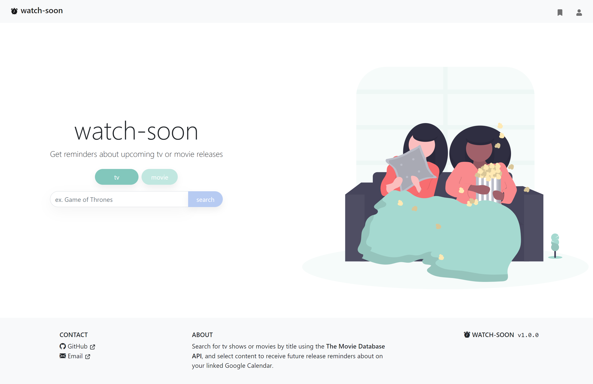
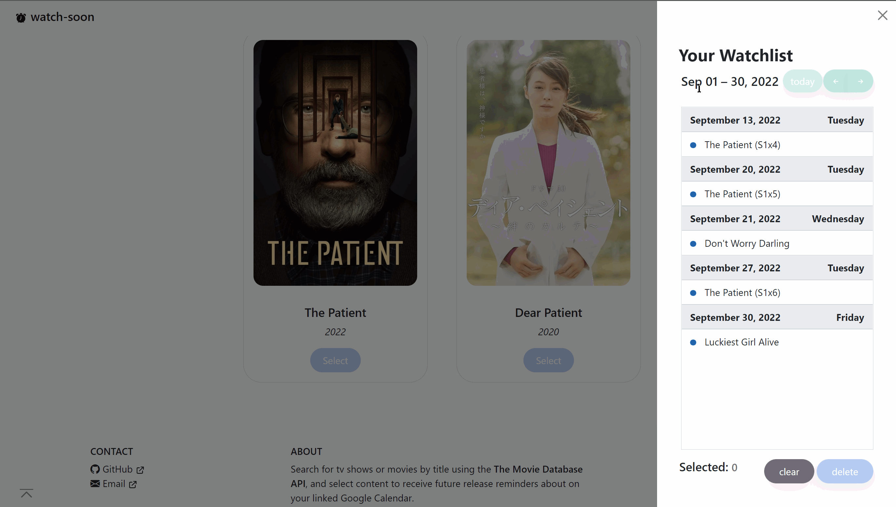

# tv-movie-reminder / watch-soon

[![React][React.js]][React-url]  
  [![Bootstrap][Bootstrap.com]][Bootstrap-url]

[![MIT License][license-shield]][license-url]

<!-- TABLE OF CONTENTS -->
## Table of Contents
  <ol>
    <li>
      <a href="#about-the-project">About The Project</a>
      <ul>
        <li><a href="#built-with">Built With</a></li>
      </ul>
    </li>
    <li>
      <a href="#demo">Demo</a>
    </li>
    <li> <a href="#usage">Usage</a>
      <ul>
        <li><a href="#connecting/disconnecting-your-google-calendar">Connecting/Disconnecting Your Google Calendar </a></li>
        <li><a href="#searching-and-adding-a-tv-series">Searching and Adding a TV Series</a></li>
        <li><a href="#searching-and-adding-a-movie">Searching and Adding a Movie</a></li>
        <li><a href="#delete-multiple-reminders-from-watchlist">Delete Multiple Reminders from Watchlist</a></li>
        <li><a href="#mobile-design">Mobile Design</a></li>
      </ul>
    </li>
    <li><a href="#roadmap">Roadmap</a></li>
    <li><a href="#license">License</a></li>
    <li><a href="#contact">Contact</a></li>
    <li><a href="#acknowledgements">Acknowledgments</a></li>
  </ol>

<!-- ABOUT THE PROJECT -->
## About The Project
<table>
<tr></tr>
<td>
  A webapp using The Movie Database API and Google Calendar API. 
    Use it to search for upcoming tv shows or movies by title and get reminders on their releases on your Google Calendar. 
</td>
</table>

### Built with 
- [ReactJS](https://reactjs.org/) - A JavaScript library for building user interfaces
- [Create React App](https://create-react-app.dev/) - Create React apps with no build configuration.
- [Express.js](https://expressjs.com/) - Fast, unopinionated, minimalist web framework for node.
- [ FullCalendar](https://fullcalendar.io/) - A full-sized drag & drop JavaScript event calendar
- [Google Calendar API](https://developers.google.com/calendar/api) - Integrate your app with Google Calendar, creating new ways for you to engage your users.
- [TheMovieDatabaseAPI](https://developers.themoviedb.org/3) - Millions of movies, TV shows and people to discover. 
- [Mongoose](https://mongoosejs.com/) - An Object Data Modeling (ODM) library for MongoDB and Node.js. 
- [Bootstrap](http://getbootstrap.com/) - Extensive list of components and  Bundled Javascript plugins.
- [Railway](https://railway.app/) - Infrastructure platform where you can provision infrastructure, develop with that infrastructure locally, and then deploy to the cloud.

(<a href="#table-of-contents">back to top</a>)

<!-- SITE -->
## Demo

### Site
Live demo: [HERE](https://watch-soon.up.railway.app/)

(<a href="#table-of-contents">back to top</a>)

## Usage
### Connecting/Disconnecting Your Google Calendar   

### Searching and Adding a TV Series

### Searching and Adding a Movie

### Delete Multiple Reminders from Watchlist

### Mobile Design

(<a href="#table-of-contents">back to top</a>)

<!-- ROADMAP -->
## Roadmap
### v1.0.0
- [x] Search The Movie Database API for tv shows or movies by title 
- [x] Display results as a collection of Bootstrap 5 cards
- [x] Filters out cancelled/released content from results
- [x] Selecting a card opens a modal with more detailed info and option to add 
- [x] Selectively add episodes to the watchlist or add all upcoming
- [x] Only adds future release dates to calendar
- [x] Authenticate with Google OAuth2 using [@react-oauth](https://github.com/MomenSherif/react-oauth) and Google API Node Client 
- [x] Adds user token database on login and uses cookies to save session state
- [x] Deletes user from the database and revokes tokens onlogout
- [x] Displays the user's profile photo, name, email, and link to Google Calendar in a Bootstrap offcanvas component
- [x] Creates a secondary calendar called 'tv-movie' in the user's Google Calendar or finds one if it exists
- [x] Display the user's Google Calendar watchlist as a [FullCalendar](https://fullcalendar.io/) list (monthly view)
- [x] Select multiple events to delete from the watchlist
- [x] Responsive mobile design using Bootstrap 5 breakpoints
### To-Do:
- [x] Deploy a live demo
- [ ] Fix modal bugs 
- [ ] Implement React Router 6
- [ ] Implement useReducer or useContext
- [ ] Optimize rendering and remove unnecessary 
- [ ] Component testing

(<a href="#table-of-contents">back to top</a>)

<!-- CONTACT -->
## Contact
[Colene Encarnado](https://github.com/encarnac)

Email: [coleneencarnado@gmail.com](coleneencarnado@gmail.com
) 
  
  Project Link: [https://github.com/encarnac/tv-movie-reminder](https://github.com/encarnac/tv-movie-reminder)

(<a href="#table-of-contents">back to top</a>)

<!-- LICENSE -->
## License
Distributed under the MIT ©  License. See `LICENSE.txt` for more information.

(<a href="#table-of-contents">back to top</a>)

<!-- ACKNOWLEDGEMENTS -->
## Acknowledgements
Images from [Undraw](https://undraw.co/)

Google Button CSS from [@google-react-login](https://github.com/anthonyjgrove/react-google-login)

Loading spinner from [Contact Mentor](https://contactmentor.com/how-to-add-loading-spinner-react-js/)

Animated scroll icon from [Unused CSS](https://unused-css.com/blog/animated-down-arrow/)

(<a href="#table-of-contents">back to top</a>)

<!-- MARKDOWN LINKS & IMAGES -->
<!-- https://www.markdownguide.org/basic-syntax/#reference-style-links -->
[license-shield]: https://img.shields.io/github/license/othneildrew/Best-README-Template.svg?style=for-the-badge
[license-url]: https://github.com/othneildrew/Best-README-Template/blob/master/LICENSE.txt
[React.js]: https://img.shields.io/badge/React-20232A?style=for-the-badge&logo=react&logoColor=61DAFB
[React-url]: https://reactjs.org/
[Bootstrap.com]: https://img.shields.io/badge/Bootstrap-563D7C?style=for-the-badge&logo=bootstrap&logoColor=white
[Bootstrap-url]: https://getbootstrap.com

